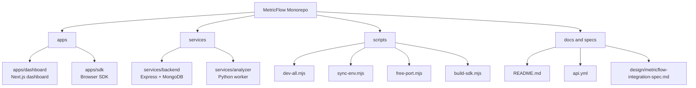
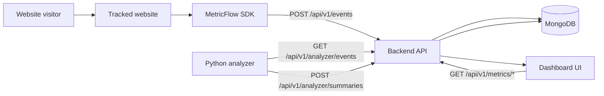
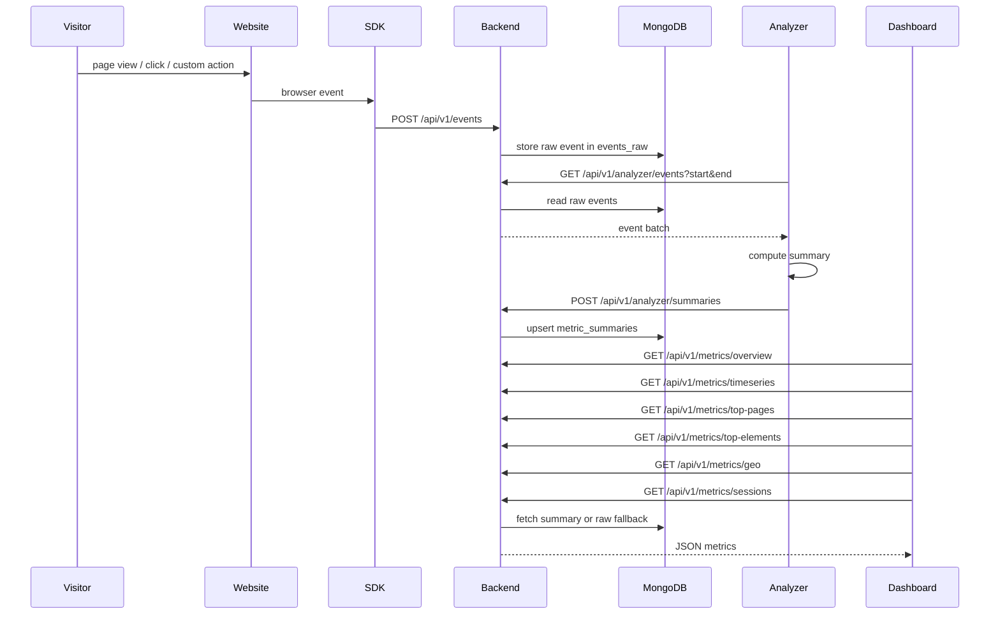
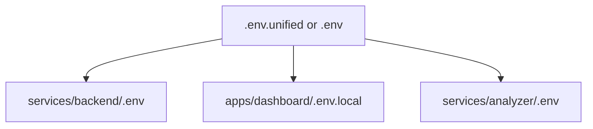
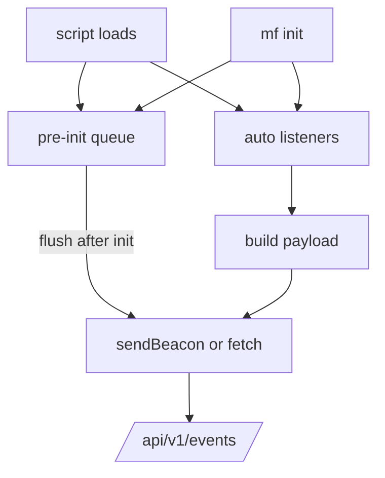
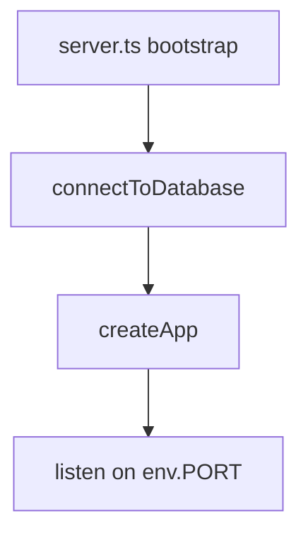
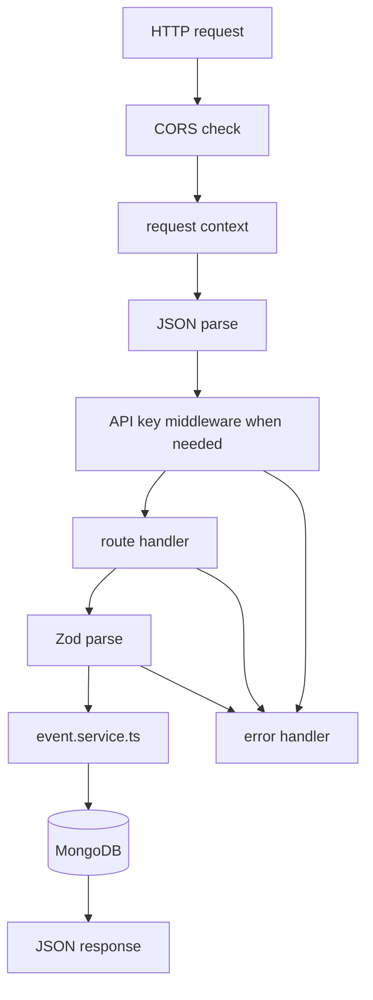
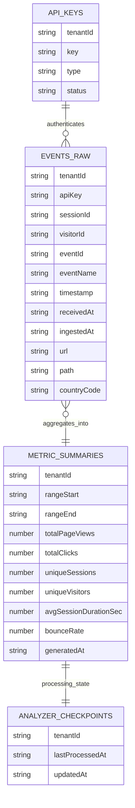
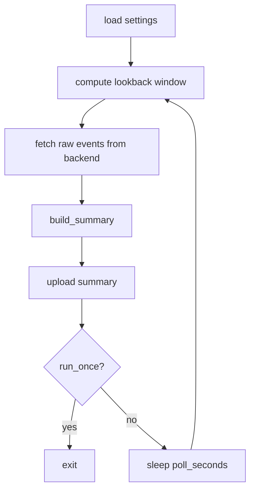
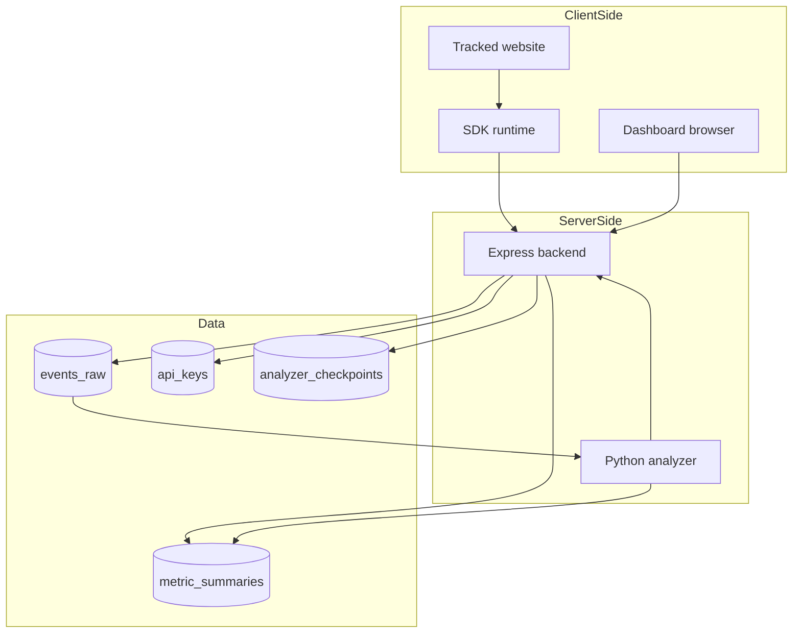

# MetricFlow Design README

## 1. What this file is

`READMEdesign.md` is code-first design document for current MetricFlow repo.

It is based on repo-owned source, configs, scripts, and Markdown docs across:

- root docs: `README.md`, `ARCHITECTURE.md`, `INSTRUCTIONS.md`, `Functions.md`, `READMEuser.md`, `api.yml`, `design/metricflow-integration-spec.md`, `db.md`
- runtime code: `apps/dashboard`, `apps/sdk`, `services/backend`, `services/analyzer`
- workspace/config files: root `package.json`, `pnpm-workspace.yaml`, `.env.unified.example`, app/service package and env examples, TS configs, scripts

Intentionally excluded from design analysis:

- generated/build/vendor/local-secret files such as `node_modules`, `.next`, `dist`, `.venv`, `package-lock` internals, `tsbuildinfo`, live `.env.local`, service-local generated envs

This doc describes current implementation first, then calls out roadmap/spec drift where docs say more than code does.

---

## 2. System summary

MetricFlow is modular event analytics platform with four runtime parts:

1. `apps/sdk`
Browser tracking SDK embedded into third-party websites.
2. `services/backend`
Central Node.js/Express API and only service allowed to touch MongoDB.
3. `services/analyzer`
Python worker that pulls raw events from backend, computes summaries, pushes summaries back.
4. `apps/dashboard`
Next.js analytics UI that logs into backend with API key and visualizes metrics.

Core product loop:

- website user interacts with tracked site
- SDK emits event payloads
- backend stores raw telemetry
- analyzer aggregates raw telemetry into summaries
- dashboard reads metrics from backend

---

## 3. Monorepo shape



### Workspace rules

- Root Node workspace includes `apps/*` and `services/backend`
- Python analyzer is outside Node workspace and uses `pyproject.toml`
- Root scripts orchestrate backend, dashboard, and analyzer together
- `.editorconfig` enforces UTF-8, LF, 2-space JS/TS/JSON/MD/YAML, 4-space Python

---

## 4. Runtime architecture



### Hard boundary

Only backend accesses MongoDB directly.

### Architectural style

- layered architecture inside each app/service
- event-ingestion pipeline across services
- backend-centric mediation model
- light multi-tenant model via API keys and `tenantId`

---

## 5. End-to-end data flow



---

## 6. Root-level design files and what each one means

| File | Purpose |
| --- | --- |
| `README.md` | main project overview, setup, team split, simple architecture |
| `ARCHITECTURE.md` | simplified ownership and service communication rules |
| `INSTRUCTIONS.md` | operating context: keep current system shape, do not redesign unless asked |
| `Functions.md` | team responsibility list |
| `READMEuser.md` | end-user SDK integration guide |
| `api.yml` | OpenAPI contract for backend routes |
| `design/metricflow-integration-spec.md` | aspirational end-to-end spec, broader than current code |
| `db.md` | legacy unrelated ER sketch; not current backend schema |
| `package.json` | root orchestration scripts |
| `.env.unified.example` | single source env template for all services |
| `pnpm-workspace.yaml` | workspace package discovery |

### Important truth source rule

When docs and code disagree, current code wins for actual behavior.

---

## 7. Root scripts and orchestration

### `scripts/dev-all.mjs`

Purpose: start backend, dashboard, analyzer from one command.

Behavior:

- resolves env source from `METRICFLOW_UNIFIED_ENV`, then `.env.unified`, then `.env`
- parses env file manually
- detects npm vs pnpm from user agent
- starts:
  - backend workspace dev server
  - dashboard workspace dev server
  - analyzer binary from local `.venv` if present, else global `metricflow-analyzer`
- prefixes stdout/stderr by service name
- stops all child processes if one exits/fails

### `scripts/sync-env.mjs`

Purpose: fan out one unified env file into per-service env files.

Generates:

- `services/backend/.env`
- `apps/dashboard/.env.local`
- `services/analyzer/.env`

### `scripts/free-port.mjs`

Purpose: free bound port using `lsof` or `fuser`, then `SIGTERM`, then `SIGKILL` fallback.

Used by backend `predev` and `prestart`.

### `scripts/build-sdk.mjs`

Purpose: invoke SDK build in workspace-aware way.

### Root npm scripts

| Script | Purpose |
| --- | --- |
| `dev:backend` | start backend only |
| `dev:dashboard` | start dashboard only |
| `dev:all` | start backend + dashboard + analyzer |
| `env:sync` | generate per-service env files |
| `build:sdk` | build SDK bundle |
| `build:backend` | compile backend TS |
| `build:dashboard` | production build dashboard |
| `lint` | workspace lint/type checks where available |
| `typecheck` | workspace type checks where available |

---

## 8. Environment model

### Unified env keys

`.env.unified.example` defines shared values for all runtimes:

- app naming: `NEXT_PUBLIC_APP_NAME`
- keying: `METRICFLOW_API_KEY`, `DEFAULT_API_KEY`, `ANALYZER_API_KEY`
- URLs: `METRICFLOW_API_URL`, `BACKEND_URL`, `CORS_ORIGIN`, `DASHBOARD_PORT`
- backend: `PORT`, `MONGODB_URI`, `JSON_BODY_LIMIT`, `MAX_ANALYZER_EVENTS`, `EVENTS_TTL_DAYS`
- analyzer: `ANALYZER_LOOKBACK_MINUTES`, `ANALYZER_POLL_SECONDS`, `ANALYZER_RUN_ONCE`, `ANALYZER_REQUEST_TIMEOUT`

### Service env split



### Dashboard env nuance

Dashboard has two env patterns in repo:

- generated/local flow: `METRICFLOW_API_URL`, `METRICFLOW_API_KEY` from `apps/dashboard/.env.example`
- documented Next public flow: `NEXT_PUBLIC_API_BASE_URL` from `apps/dashboard/.env.local.example`

Current runtime code mainly uses:

- relative browser API base `/api/v1` in `apps/dashboard/services/api.ts`
- Next rewrites in `apps/dashboard/next.config.js`
- fallback envs only for legacy `apps/dashboard/lib/api.ts`

---

## 9. SDK design

### Purpose

SDK is lightweight browser script that captures telemetry from external websites.

### Public API

Current supported commands:

- `mf("init", apiKey, options?)`
- `mf("init", { token | apiKey, ...options })`
- `mf("track", eventName, properties?)`

### Supported event families

- `page_view`
- `click`
- `scroll_depth`
- `performance`
- `session_end`
- arbitrary custom string events

### Internal state model

File: `apps/sdk/src/index.ts`

State fields:

- `apiKey`
- `endpoint`
- `scriptId`
- `autoTrack`
- `enableScrollTracking`
- `enablePerfTracking`
- `initialized`
- `listenersAttached`
- `sessionEnding`
- `lastTrackedPageKey`
- pre-init event `queue`
- `pageLoadTimestamp`

### Storage model

- session id in `sessionStorage` key `mf_session_id`
- visitor id in `localStorage` key `mf_visitor_id`

### Bootstrap modes

1. Explicit JS init via `mf("init", ...)`
2. Auto-init from `<script>` attributes:
   - `data-mf-token`
   - `data-mf-api-key`
   - `data-api-key`

Optional script attributes:

- `data-mf-endpoint`
- `data-mf-script-id`
- `data-mf-auto-track`
- `data-mf-scroll`
- `data-mf-perf`

### Event payload shape

SDK emits payload with fields such as:

- `apiKey`
- `schemaVersion`
- `scriptId`
- `sessionId`
- `visitorId`
- `eventName`
- `timestamp`
- `url`
- `path`
- `referrer`
- `userAgent`
- `viewport`
- `screen`
- `tzOffsetMin`
- `locale`
- `countryCode`
- `properties`
- `element`

### SDK behavior diagram



### Auto-tracking logic

- page views on:
  - page load
  - `pushState`
  - `replaceState`
  - `popstate`
  - `hashchange`
- clicks on document-level click listener
- scroll milestones: 25, 50, 75, 90 percent
- performance:
  - FCP via `PerformanceObserver`
  - TTFB from navigation timing
- session end:
  - `visibilitychange`
  - `pagehide`
  - `beforeunload`

### Transport behavior

- normal events: `fetch` with `keepalive`
- `session_end`: try `navigator.sendBeacon`, fallback to `fetch`

### Important implementation notes

- SDK currently sends single events to `/api/v1/events`
- `/api/v1/events/batch` exists in backend contract but current SDK does not use batch flush
- queue is mainly pre-init buffering, not timed batching system
- SDK attaches listeners even before full init, so early events can queue
- endpoint inference:
  - explicit `data-mf-endpoint`
  - else infer `/api/v1/events` from script origin
  - else fallback `/api/v1/events`

### Files

| File | Role |
| --- | --- |
| `apps/sdk/src/index.ts` | full SDK implementation |
| `apps/sdk/scripts/postbuild.mjs` | copy `dist/index.global.js` to `dist/metricflow.js` |
| `apps/sdk/examples/embed.html` | local embed demo |
| `apps/sdk/README.md` | SDK usage guide |

---

## 10. Backend design

### Purpose

Backend is central mediator for ingest, persistence, analyzer exchange, and dashboard reads.

### Tech stack

- Node.js
- Express
- TypeScript
- Mongoose
- Zod
- CORS
- dotenv

### Boot flow



### App assembly

`services/backend/src/app.ts` does:

- parse allowed CORS origins from comma-separated env
- attach CORS middleware with runtime origin check
- attach request context middleware
- attach JSON body parser with env-configurable size limit
- serve built SDK from `/mf.js`
- mount routers:
  - `/health`
  - `/api/v1/events`
  - `/api/v1/analyzer`
  - `/api/v1/metrics`
- mount `notFoundHandler`
- mount `errorHandler`

### Middleware layer

#### `attachRequestContext`

- assigns UUID request id
- stores `requestId` and `serverTime` in `response.locals`
- writes `x-request-id` header

#### `requireApiKey`

Accepts API key from:

- `x-api-key` header
- `body.apiKey`
- `query.apiKey`

Validation behavior:

- accepts exact `DEFAULT_API_KEY`
- accepts any string starting with `mf_`
- if API key document exists in `api_keys`, enforces `status=active`
- checks allowed origins only when origin present and key has restrictions
- if no DB key doc exists, backend still allows `mf_*` key and sets tenant to raw key

This means current auth model is permissive for local/dev scenarios.

#### `errorHandler`

Handles:

- Zod validation errors -> `400 VALIDATION_ERROR`
- invalid JSON syntax -> `400 INVALID_JSON`
- `AppError` -> custom status/code/details
- unknown errors -> `500 INTERNAL_ERROR`

#### `notFoundHandler`

Returns structured `404 ROUTE_NOT_FOUND`.

### Backend routes

| Route | Method | Consumer | Behavior |
| --- | --- | --- | --- |
| `/health` | GET | anyone | liveness |
| `/api/v1/events` | POST | SDK | ingest single event |
| `/api/v1/events/batch` | POST | SDK | ingest event batch |
| `/api/v1/analyzer/events` | GET | analyzer | fetch raw events by time range |
| `/api/v1/analyzer/summaries` | POST | analyzer | upsert metric summary |
| `/api/v1/analyzer/checkpoint` | GET | analyzer | read checkpoint |
| `/api/v1/analyzer/checkpoint` | PUT | analyzer | update checkpoint |
| `/api/v1/metrics/overview` | GET | dashboard | overview metrics |
| `/api/v1/metrics/timeseries` | GET | dashboard | timeseries metrics |
| `/api/v1/metrics/top-pages` | GET | dashboard | ranked pages |
| `/api/v1/metrics/top-elements` | GET | dashboard | ranked clicked elements |
| `/api/v1/metrics/geo` | GET | dashboard | geographic distribution |
| `/api/v1/metrics/sessions` | GET | dashboard | session metrics |
| `/api/v1/metrics/health/ping` | GET | dashboard/login | backend/db health |

### Request lifecycle



### Service layer: `event.service.ts`

Main functions:

- ingestion:
  - `ingestEvent`
  - `ingestBatch`
- analyzer exchange:
  - `getEventsForAnalysis`
  - `saveMetricSummary`
  - `getCheckpoint`
  - `updateCheckpoint`
- dashboard metrics:
  - `getOverview`
  - `getOverviewForRange`
  - `getRankedPages`
  - `getRankedElements`
  - `getGeoMetrics`
  - `getSessionMetrics`
  - `getTimeseries`

Internal helpers:

- `rank`
- `buildSessionMetrics`
- `toBucket`
- `buildTimeseries`
- `normalizeCountryCode`
- `resolveVisitorId`
- `getLatestSummary`
- `inferInterval`

### Fallback strategy

Backend prefers summarized data when convenient, but can compute from raw events.

Examples:

- overview without range -> latest summary else raw full-tenant scan
- overview with exact range -> exact summary else raw query
- top pages/elements/geo without range -> latest summary slice
- timeseries without range -> latest summary timeseries
- sessions always computed from raw events for requested range

### Mongo models and collections



Actual collections:

- `api_keys`
- `events_raw`
- `metric_summaries`
- `analyzer_checkpoints`

### Persistence details

#### Raw events: `event.model.ts`

Indexes:

- `{ tenantId, timestamp }`
- `{ tenantId, sessionId, timestamp }`
- `{ tenantId, visitorId, timestamp }`
- `{ tenantId, eventName, timestamp }`
- unique `{ tenantId, eventId }`
- TTL on `receivedAt` using `EVENTS_TTL_DAYS`

#### Summaries: `metric-summary.model.ts`

- unique summary window by `{ tenantId, rangeStart, rangeEnd }`
- generatedAt descending index by tenant

#### Checkpoints: `analyzer-checkpoint.model.ts`

- unique `tenantId`

### Query semantics

- timestamps stored as ISO strings, queried lexicographically
- all range filters use inclusive `$gte` and `$lte`
- session bounce means `pageViews <= 1 && clicks === 0`
- page ranking keys by event `url`
- element ranking keys by `element.id`, else `element.text`, else `element.tagName`, else `unknown`
- geo metrics dedupe by visitor id per country

### Backend file map

| File | Role |
| --- | --- |
| `src/server.ts` | bootstrap |
| `src/app.ts` | Express assembly |
| `src/config/env.ts` | env validation |
| `src/config/database.ts` | DB connect/ping helpers |
| `src/lib/app-error.ts` | typed app error |
| `src/middleware/*` | auth, error, 404, request context |
| `src/routes/*` | route entrypoints |
| `src/modules/events/*.model.ts` | Mongoose models |
| `src/modules/events/*.schema.ts` | Zod request schemas |
| `src/modules/events/event.service.ts` | domain logic |

---

## 11. Analyzer design

### Purpose

Analyzer is Python worker that transforms raw events into summary metrics.

### Tech stack

- Python 3.11+
- `requests`
- `python-dotenv`
- `user-agents`
- `pytest`

### Runtime files

| File | Role |
| --- | --- |
| `config.py` | env loader into immutable `Settings` dataclass |
| `client.py` | HTTP client with retries |
| `models.py` | `MetricSummary` and `RankedMetric` dataclasses |
| `metrics.py` | aggregation logic |
| `worker.py` | run cycle / loop entrypoint |
| `tests/test_metrics.py` | summary behavior smoke test |

### Worker cycle



### Settings

Loaded from env:

- `BACKEND_URL`
- `ANALYZER_API_KEY`
- `ANALYZER_LOOKBACK_MINUTES`
- `ANALYZER_POLL_SECONDS`
- `ANALYZER_RUN_ONCE`
- `ANALYZER_REQUEST_TIMEOUT`

### HTTP client behavior

`MetricFlowBackendClient`:

- stores `x-api-key`
- uses `requests.Session`
- retries `429, 500, 502, 503, 504`
- retries allowed on `HEAD`, `GET`, `OPTIONS`, `POST`
- fetches events by start/end
- uploads summary as JSON

### Aggregation logic in `metrics.py`

What it computes:

- `total_page_views`
- `total_clicks`
- `unique_sessions`
- `unique_visitors`
- `avg_session_duration_sec`
- `bounce_rate`
- `top_pages`
- `top_elements`
- `geo_breakdown`
- `timeseries`
- `browser_breakdown`
- `os_breakdown`
- `device_breakdown`
- `funnel_steps`
- `anomalies_detected`

How it computes:

- session counts via `sessionId`
- unique visitors via `visitorId` fallback to `sessionId`
- country via `countryCode` or locale suffix
- path via explicit `path` else URL pathname
- browser/OS/device via `user-agents`
- hourly buckets via timestamp truncated to hour
- funnel:
  - step 1 any page
  - step 2 pricing page
  - step 3 sign-up click
- anomalies:
  - more than 10 `error` events
  - more than 10,000 page views in analyzed range

### Important implementation notes

- worker currently uses rolling lookback window, not checkpoint route
- backend exposes checkpoint endpoints, but analyzer code does not call them
- every run writes summary for exact `[range_start, range_end]`
- summary windows shift every cycle, producing new overlapping summaries

### Analyzer/backend schema drift

Analyzer uploads extra fields:

- `browserBreakdown`
- `osBreakdown`
- `deviceBreakdown`
- `funnelSteps`
- `anomaliesDetected`

Current backend summary schema does not define these fields, so they are ignored/stripped on ingest.

That means analyzer computes richer analytics than backend currently persists or dashboard shows.

---

## 12. Dashboard design

### Purpose

Dashboard is Next.js App Router frontend for analytics viewing.

### Tech stack

- Next.js 14
- React 18
- TypeScript
- Recharts
- react-simple-maps
- d3-scale

### Top-level routing

Actual route files:

- `/` -> redirects to `/login`
- `/login`
- `/dashboard`
- `/dashboard/events`
- `/dashboard/pages`
- `/dashboard/retention`

### Dashboard shell

```mermaid
flowchart TD
  Root[app/layout.tsx]
  UserProvider[UserProvider]
  Login[/login]
  DashLayout[/dashboard/layout.tsx]
  Guard[AuthGuard]
  Sidebar[Sidebar]
  Navbar[DashboardNavbar]
  Page[route page]

  Root --> UserProvider
  UserProvider --> Login
  UserProvider --> DashLayout
  DashLayout --> Guard --> Sidebar
  Guard --> Navbar
  Guard --> Page
```

### Auth/session model

Current login is not username/password auth. It is API-key-backed workspace session.

Flow:

1. user enters workspace name + backend API key
2. dashboard calls `validateApiKey(apiKey)`
3. validation hits `/api/v1/metrics/health/ping`
4. if success, dashboard stores local session in `localStorage`
5. `AuthGuard` allows dashboard routes

Stored session key:

- `metricflow_dashboard_session`

Stored fields:

- `firstName`
- `lastName`
- `email`
- `mobile`
- `role`
- `timezone`
- `apiKey`
- `tenantId`

### Data access architecture

Dashboard enforces:

component -> hook -> service API -> backend

```mermaid
flowchart LR
  UI[page/components]
  Hooks[custom hooks]
  API[services/api.ts]
  Rewrite[/api/v1 rewrite]
  Backend[backend routes]

  UI --> Hooks --> API --> Rewrite --> Backend
```

### Core dashboard files

| File | Role |
| --- | --- |
| `app/layout.tsx` | root layout + `UserProvider` |
| `app/login/page.tsx` | API-key login screen |
| `app/dashboard/layout.tsx` | protected app shell |
| `components/AuthGuard.tsx` | route gate |
| `components/Sidebar.tsx` | left navigation |
| `components/DashboardNavbar.tsx` | header + account popovers |
| `components/FilterBar.tsx` | date presets / event filter UI |
| `components/MetricCard.tsx` | KPI card |
| `components/ChartWrapper.tsx` | chart container, loading, error |
| `components/LineChartComponent.tsx` | timeseries chart |
| `components/BarChartComponent.tsx` | top pages chart |
| `components/PieChartComponent.tsx` | click distribution donut |
| `components/GeoMapComponent.tsx` | world choropleth |
| `components/ExportButton.tsx` | CSV export |
| `hooks/*` | route-facing data loaders |
| `services/api.ts` | one browser API layer |
| `lib/auth-session.ts` | local session persistence |
| `utils/formatters.ts` | view formatting |

### Route behavior

#### `/dashboard`

Uses:

- `useOverviewMetrics`
- `useTopPages`
- `useClickMetrics`
- `useTrends`
- `useGeoMetrics`

Shows:

- KPI cards
- trends line chart
- top pages bar chart
- click distribution donut
- geographic map

#### `/dashboard/events`

Uses:

- overview
- click metrics
- trends

Shows:

- event KPIs
- event trend
- click distribution
- top click label list

#### `/dashboard/pages`

Uses:

- overview
- top pages
- trends

Shows:

- page KPIs
- ranked pages chart
- page activity trend
- page ranking detail list

#### `/dashboard/retention`

Uses:

- session metrics
- trends

Shows:

- sessions
- average duration
- bounce rate
- session trend
- recent session list

### Hook pattern

All hooks follow same pattern:

- local `data`
- local `isLoading`
- local `error`
- `tick` state for `refetch`
- `useEffect` for load
- `useCallback` wrapped fetch function

Hooks present:

- `useOverviewMetrics`
- `useTopPages`
- `useClickMetrics`
- `useTrends`
- `useGeoMetrics`
- `useSessionMetrics`
- `useBackendHealth`

### API service mapping

`apps/dashboard/services/api.ts` translates backend contracts into UI-friendly shapes.

Mappings:

- overview -> KPI cards with computed deltas/trends
- top pages -> `{ key,count }` to `{ path,views }`
- top elements -> distribution percentages
- timeseries -> daily/hourly response + client aggregation to week/month
- geo -> country code to human country name
- sessions -> pass-through of session rows

### Client-side analytics helpers

- `percentageDelta` for KPI changes
- `buildTrend` to classify `up/down/flat`
- `shiftRange` to query previous comparison window
- `resolveGranularity` to decide hour/day/week/month display
- `aggregateTrends` to roll daily data into week/month on client

### Design system

`app/globals.css` is large single-file design system and page styling layer.

Tokens defined in `:root`:

- colors:
  - `--color-bg`
  - `--color-surface`
  - `--color-surface-2`
  - `--color-surface-3`
  - `--color-border`
  - `--color-accent`
  - `--color-amber`
  - `--color-violet`
  - `--color-green`
  - `--color-red`
- typography:
  - `--font-display` = Syne
  - `--font-body` = DM Sans
  - `--font-mono` = DM Mono
- layout:
  - `--sidebar-w`
  - `--navbar-h`
  - `--gap`
  - `--radius`
- shadows:
  - `--shadow-card`
  - `--shadow-accent`

Visual direction:

- lighter dark dashboard aesthetic
- grid texture background
- accent blue + amber + violet palette
- card-heavy dashboard layout
- animated login orbs
- skeleton loaders and chart placeholders

### Dashboard-specific design notes

- `MetricCard` supports delta-based or context-label-based rendering
- `ChartWrapper` centralizes empty/error/loading framing
- `ExportButton` turns array-of-objects into CSV in browser
- `GeoMapComponent` depends on remote TopoJSON from jsDelivr
- `DashboardNavbar` adds notification/profile popovers
- `Sidebar` is route-aware and fixed-position

### Next.js integration

`next.config.js`:

- rewrites `/api/v1/:path*` to backend URL
- backend URL derived from `NEXT_PUBLIC_API_BASE_URL` or `METRICFLOW_API_URL`
- attaches security headers:
  - `X-Content-Type-Options`
  - `X-Frame-Options`
  - `Referrer-Policy`
  - `X-XSS-Protection`

### Legacy / unused dashboard artifacts

These exist in repo but are not part of current live route graph:

- `apps/dashboard/components/Navbar.tsx`
- `apps/dashboard/components/metric-card.tsx`
- `apps/dashboard/lib/api.ts`
- `apps/dashboard/setup.js`

Also `globals.css` contains settings/profile styling for routes that do not currently exist.

---

## 13. API and contract design

### Implemented contract surface

`api.yml` documents most backend routes and schemas.

Important current schemas include:

- `EventPayload`
- `EventBatchRequest`
- `MetricSummaryPayload`
- `MetricOverview`
- `TimeseriesResponse`
- `RankedMetricsResponse`
- `SessionMetricsResponse`
- `AnalyzerCheckpoint`
- `HealthResponse`
- `PingResponse`

### Contract nuance

`api.yml` documents:

- `/api/v1/events/batch`
- analyzer checkpoint endpoints
- metrics overview/timeseries/top-pages/top-elements/sessions/health ping

But code also implements:

- `/api/v1/metrics/geo`

`/metrics/geo` is real backend behavior used by dashboard, but missing from `api.yml`.

---

## 14. Current file-by-file structure summary

```text
.
├── apps
│   ├── dashboard
│   │   ├── app
│   │   │   ├── login
│   │   │   └── dashboard
│   │   ├── components
│   │   ├── contexts
│   │   ├── hooks
│   │   ├── lib
│   │   ├── services
│   │   └── utils
│   └── sdk
│       ├── src
│       ├── scripts
│       └── examples
├── services
│   ├── backend
│   │   └── src
│   │       ├── config
│   │       ├── lib
│   │       ├── middleware
│   │       ├── modules/events
│   │       └── routes
│   └── analyzer
│       ├── src/metricflow_analyzer
│       └── tests
├── scripts
├── README.md
├── ARCHITECTURE.md
├── api.yml
└── READMEdesign.md
```

---

## 15. What works today vs what is roadmap/spec

### Working today

- SDK single-event ingest
- backend raw event persistence
- analyzer pull -> summarize -> push
- dashboard login by API key
- dashboard overview/events/pages/retention routes
- top pages, click metrics, session metrics, timeseries, geo metrics
- backend health ping
- serving SDK bundle from backend `/mf.js`

### Declared in docs/spec, but only partial or not implemented

- SDK batch flushing model from spec
- checkpoint-driven analyzer processing
- richer analyzer outputs persisted by backend
- settings/profile routes linked by navbar
- full auth system beyond API-key workspace session
- websocket/realtime updates
- queue infra like Redis/Kafka mentioned conceptually in docs

---

## 16. Important mismatches and design caveats

### 1. Analyzer richer than backend

Analyzer computes browser/OS/device/funnel/anomaly data, but backend schema strips it. Current system loses those dimensions after upload.

### 2. Checkpoint API exists but analyzer does not use it

Backend supports analyzer checkpoints, but worker currently reprocesses rolling lookback windows instead of advancing checkpoint state.

### 3. Event type filter UI is not wired through

`FilterBar` exposes `eventType`, but `apps/dashboard/services/api.ts` does not send `eventType` to backend for overview/top-pages/top-elements/geo/sessions/trends. Filter exists visually, not functionally.

### 4. Geo endpoint missing from OpenAPI

Dashboard depends on `/api/v1/metrics/geo`, but `api.yml` does not document it.

### 5. SDK simpler than spec

Spec describes queued/batched telemetry with flush interval and max queue size. Current SDK implementation is leaner: immediate single-event POSTs plus pre-init queue.

### 6. Navbar links point to missing routes

`DashboardNavbar` links to `/dashboard/settings` and `/dashboard/settings/profile`, but those pages are not in current `app` tree.

### 7. Legacy dashboard files remain

Some files are scaffold leftovers and not part of live import graph.

### 8. `db.md` is not current DB model

It shows unrelated `User` and `Transactions` entities. Current backend Mongo schema is defined in backend model files, not `db.md`.

### 9. Top page duration is placeholder-friendly, not backend-backed

Bar chart tooltip can show `avgDuration`, but backend top-pages response only returns rank counts. Current mapping leaves duration undefined.

---

## 17. Design principles visible in code

- backend-centered integration boundary
- only backend owns persistence
- schemas validated at service edges
- UI components mostly render-only, hooks own fetching
- small SDK footprint with fire-and-forget transport
- analyzer designed as externally deployable worker
- environment centralization through root env sync
- graceful fallback from summaries to raw event aggregation

---

## 18. How each major function works

### SDK

- `init`: sets API key/options, infers endpoint, enables listeners, flushes queued events
- `track`: builds payload and sends or queues event
- `attachAutoTracking`: wires page/click/navigation/session listeners
- `trackPageView`: dedupes by route key and attaches UTM metadata

### Backend

- `createApp`: assembles middleware and routers
- `requireApiKey`: resolves API key and tenant context
- `ingestEvent` / `ingestBatch`: normalize payload and persist
- `getOverview*`: summary-first overview retrieval
- `getTimeseries`: return summary timeseries or build from raw events
- `getSessionMetrics`: group events into sessions and compute duration/bounce

### Analyzer

- `load_settings`: reads environment
- `fetch_events`: pulls raw event window
- `build_summary`: aggregates event list into summary dataclass
- `upload_summary`: POSTs summary back to backend
- `run_cycle`: one full poll-compute-upload pass

### Dashboard

- `validateApiKey`: health-ping login check
- `api.getOverviewMetrics`: current + previous range comparison for KPI deltas
- `api.getTrends`: backend timeseries + client-side week/month aggregation
- `UserProvider`: hydrate/store workspace session
- hooks: wrap API fetch state for route components

---

## 19. Suggested mental model for whole system

Think of MetricFlow as two data layers plus one presentation layer:

1. raw telemetry layer
SDK -> backend -> `events_raw`

2. summary analytics layer
analyzer -> backend -> `metric_summaries`

3. presentation layer
dashboard -> backend -> charts/cards/lists

---

## 20. Best places to change things

### Add new tracked browser event

- SDK: `apps/sdk/src/index.ts`
- backend payload schema: `services/backend/src/modules/events/event.schema.ts`
- backend persistence/query logic: `services/backend/src/modules/events/event.service.ts`
- analyzer aggregation: `services/analyzer/src/metricflow_analyzer/metrics.py`
- dashboard surface: `apps/dashboard/services/api.ts` + hook + page/chart

### Add new dashboard metric

- backend route/service output
- dashboard `services/api.ts`
- matching hook in `hooks`
- page/component render

### Tighten auth

- backend `middleware/api-key.ts`
- `api_keys` collection lifecycle
- dashboard login/session logic

### Make analyzer incremental

- wire `worker.py` to checkpoint GET/PUT routes
- make summaries align to deterministic windows

---

## 21. Final architecture snapshot



---

## 22. Short conclusion

MetricFlow is already usable as backend-centered event analytics stack with live ingest, aggregation, and dashboard visualization. Current code favors simple deployable architecture over heavy infra. Biggest next design gains would come from:

- wiring analyzer checkpoints
- persisting richer analyzer outputs
- documenting `/metrics/geo`
- making dashboard event filter real
- removing or completing legacy dashboard routes/artifacts
