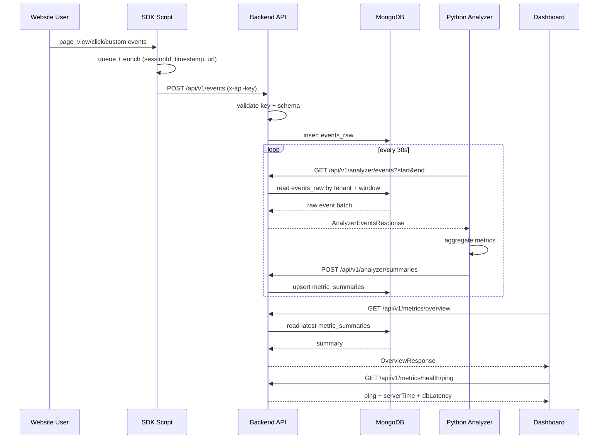
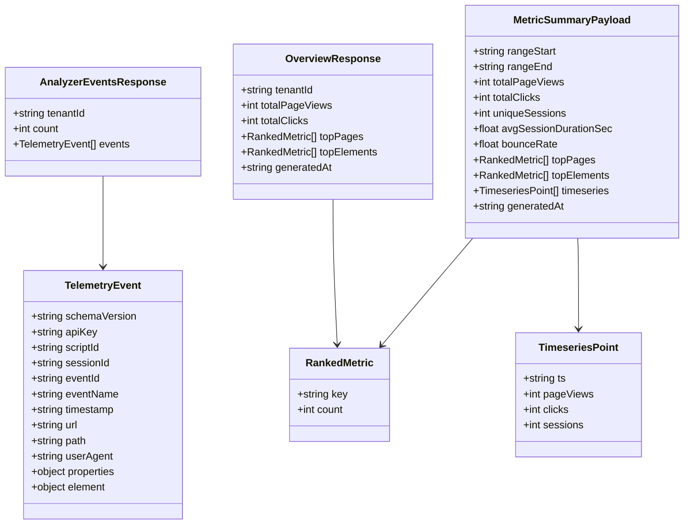
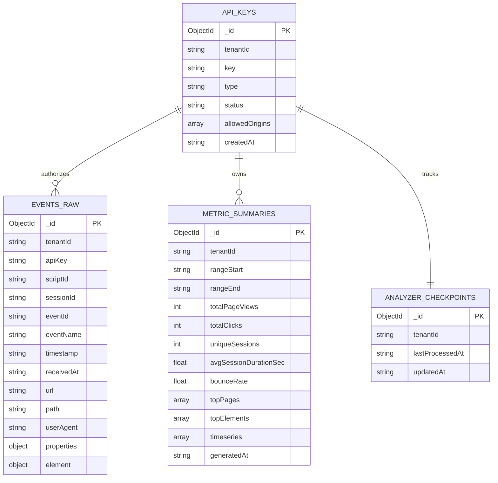

# MetricFlow End-to-End Integration Spec

Version: 1.0
Date: 2026-04-23
Status: Draft for implementation

## 1. Scope

This document defines the full data and communication contract between:

- SDK (browser script) in apps/sdk
- Backend API (Node.js + Express) in services/backend
- Analyzer worker (Python) in services/analyzer
- Dashboard (Next.js) in apps/dashboard

It follows current architecture policies:

- SDK -> Backend only
- Analyzer -> Backend only
- Dashboard -> Backend only
- Only Backend accesses MongoDB directly

This spec is designed for low-cost hosting (free tiers), so it avoids expensive infrastructure.

## 2. System Communication Blueprint

### 2.1 Protocols

- SDK to Backend: HTTPS, REST JSON, sendBeacon/fetch with keepalive
- Analyzer to Backend: HTTPS, REST JSON (poll + upload)
- Dashboard to Backend: HTTPS, REST JSON (read-only metrics)
- Backend to MongoDB: Mongoose over MongoDB driver connection string

### 2.2 Required Endpoints (Current + Expanded)

Current implemented endpoints:

- GET /health
- POST /api/v1/events
- GET /api/v1/analyzer/events
- POST /api/v1/analyzer/summaries
- GET /api/v1/metrics/overview

Expanded endpoints for complete dashboard/analyzer roadmap:

- GET /api/v1/metrics/timeseries?start&end&interval&eventName
- GET /api/v1/metrics/top-pages?start&end&limit
- GET /api/v1/metrics/top-elements?start&end&limit
- GET /api/v1/metrics/sessions?start&end
- GET /api/v1/metrics/health/ping
- GET /api/v1/analyzer/checkpoint
- PUT /api/v1/analyzer/checkpoint

## 3. Canonical Time, Date, and Ping Spec

### 3.1 Time Fields

All time fields are ISO 8601 with UTC offset, example: 2026-04-23T13:02:11.512Z.

Canonical timestamps:

- event.timestamp: when event occurred in browser
- event.receivedAt: when backend accepted event
- event.ingestedAt: when event was persisted
- summary.rangeStart: analyzer aggregation window start
- summary.rangeEnd: analyzer aggregation window end
- summary.generatedAt: when analyzer generated summary
- response.serverTime: backend response time for client clock sync

### 3.2 Clock Handling Rules

- Backend is source of truth for all processing windows
- SDK client timestamps are accepted but tagged as client time
- Analyzer windows are backend-time driven, not browser-time driven
- Dashboard displays local timezone but queries UTC boundaries

### 3.3 Ping and Availability Rules

- Health endpoint: GET /health
- Ping endpoint: GET /api/v1/metrics/health/ping

Ping response object:

```json
{
  "status": "ok",
  "service": "metricflow-backend",
  "serverTime": "2026-04-23T13:02:11.512Z",
  "requestId": "7d38f8ce-5f17-4ec2-a5db-3a8674d3f23b",
  "db": {
    "connected": true,
    "latencyMs": 14
  },
  "uptimeSec": 9232
}
```

Dashboard computes round-trip ping as:

pingMs = clientReceiveTs - clientSendTs

## 4. SDK Script Spec

### 4.1 Script Embedding in User Website

Recommended embed template:

```html
<script>
  (function (w, d, s, src, key) {
    w.mf =
      w.mf ||
      function () {
        (w.mf.q = w.mf.q || []).push(arguments);
      };
    w.mf.l = Date.now();
    var js = d.createElement(s);
    js.async = true;
    js.src = src;
    js.setAttribute("data-mf-key", key);
    var fjs = d.getElementsByTagName(s)[0];
    fjs.parentNode.insertBefore(js, fjs);
  })(
    window,
    document,
    "script",
    "https://cdn.metricflow.app/sdk/v1/index.global.js",
    "mf_pk_demo_123",
  );

  mf("init", "mf_pk_demo_123", {
    endpoint: "https://api.metricflow.app/api/v1/events",
    autoTrack: true,
    flushIntervalMs: 10000,
    maxQueueSize: 20,
  });
</script>
```

### 4.2 SDK Public API

```ts
type MFInitOptions = {
  endpoint?: string;
  autoTrack?: boolean;
  flushIntervalMs?: number; // default 10000
  maxQueueSize?: number; // default 20
  heartbeatIntervalMs?: number; // default 30000
  enableScrollTracking?: boolean;
  enablePerfTracking?: boolean;
};

type MFTrackProperties = Record<string, unknown>;

declare function mf(
  command: "init",
  apiKey: string,
  options?: MFInitOptions,
): void;
declare function mf(
  command: "track",
  eventName: string,
  properties?: MFTrackProperties,
): void;
declare function mf(
  command: "identify",
  userId: string,
  traits?: MFTrackProperties,
): void;
```

### 4.3 SDK Authentication

Low-cost secure model:

- SDK uses publishable key (mf*pk*\*)
- Backend maps key -> tenantId
- Backend enforces:
  - allowed origin list per key
  - per-key rate limits
  - payload size and schema validation

Optional hardening (phase 2):

- backend-minted short-lived ingest token via signed JWT
- SDK refreshes token every 30 minutes

### 4.4 SDK Telemetry Types and Schedules

| Event        | Trigger                      | Default Schedule              | Transport        | Retry         |
| ------------ | ---------------------------- | ----------------------------- | ---------------- | ------------- |
| page_view    | on load, route change        | immediate + queue flush       | sendBeacon/fetch | yes           |
| click        | on document click            | queued, flush 10s             | fetch keepalive  | yes           |
| custom_event | app calls mf("track")        | queued, flush 10s             | fetch keepalive  | yes           |
| scroll_depth | debounced scroll             | every 15s max                 | fetch            | yes           |
| heartbeat    | active tab session pulse     | every 30s                     | fetch keepalive  | no hard retry |
| performance  | PerformanceObserver snapshot | once after load + on soft nav | fetch            | yes           |
| session_end  | visibilitychange/unload      | on page hide                  | sendBeacon       | no            |

Queue flush conditions:

- every flushIntervalMs
- queue length >= maxQueueSize
- visibilitychange to hidden
- beforeunload/pagehide

### 4.5 SDK Event Object Contract

```ts
type TelemetryEvent = {
  schemaVersion: "1.0";
  apiKey: string;
  scriptId: string; // static per embed snippet
  tenantId?: string; // assigned by backend
  sessionId: string;
  eventId: string; // uuid
  eventName: string;
  timestamp: string; // client time ISO
  url: string;
  path: string;
  referrer?: string;
  userAgent: string;
  viewport?: { w: number; h: number };
  screen?: { w: number; h: number };
  tzOffsetMin?: number;
  locale?: string;
  properties: Record<string, unknown>;
  element?: {
    tagName?: string;
    id?: string;
    classes?: string[];
    text?: string;
    x?: number;
    y?: number;
  };
};

type EventBatchRequest = {
  sentAt: string;
  sdkVersion: string;
  events: TelemetryEvent[];
};
```

Single-event compatibility mode (current implementation) is still valid:

- POST /api/v1/events with one EventPayload object

## 5. Backend Spec (API and Processing)

### 5.1 Core Backend Functions

Ingestion and retrieval:

- requireApiKey(request): validate key, assign tenantId
- ingestEvent(tenantId, payload): persist raw event
- getEventsForAnalysis(tenantId, start, end): fetch sorted event batch
- saveMetricSummary(tenantId, payload): upsert summary by range
- getOverview(tenantId): latest summary fallback to raw aggregation

Additional backend functions required by this spec:

- ingestBatch(tenantId, EventBatchRequest)
- getTimeseries(tenantId, query)
- getTopPages(tenantId, query)
- getTopElements(tenantId, query)
- getSessionMetrics(tenantId, query)
- getPingStatus()
- getAnalyzerCheckpoint(tenantId)
- setAnalyzerCheckpoint(tenantId, checkpoint)

### 5.2 Backend Event Acceptance Response

```json
{
  "accepted": true,
  "tenantId": "mf_pk_demo_123",
  "requestId": "7d38f8ce-5f17-4ec2-a5db-3a8674d3f23b",
  "acceptedCount": 20,
  "rejectedCount": 0,
  "serverTime": "2026-04-23T13:02:11.512Z"
}
```

### 5.3 Standard Error Object

```json
{
  "error": "Invalid request payload",
  "code": "VALIDATION_ERROR",
  "issues": {},
  "requestId": "7d38f8ce-5f17-4ec2-a5db-3a8674d3f23b",
  "serverTime": "2026-04-23T13:02:11.512Z"
}
```

### 5.4 Communication Rules

- All services send x-api-key
- Backend sets x-request-id in every response
- Dashboard and analyzer pass API key via header, not query string
- API payload max size: 256 KB (current)
- Event batch max count: 50 per request (recommended)

## 6. Dashboard Frontend Spec

### 6.1 Data Fetching Functions

Frontend API module function contracts:

```ts
type DateRange = { start: string; end: string };
type OverviewResponse = {
  tenantId: string;
  totalPageViews: number;
  totalClicks: number;
  topPages: Array<{ key: string; count: number }>;
  topElements: Array<{ key: string; count: number }>;
  generatedAt: string;
};

type TimeseriesPoint = {
  ts: string;
  pageViews: number;
  clicks: number;
  sessions: number;
};

type TimeseriesResponse = {
  tenantId: string;
  interval: "hour" | "day";
  rangeStart: string;
  rangeEnd: string;
  points: TimeseriesPoint[];
  generatedAt: string;
};

async function getOverview(range?: DateRange): Promise<OverviewResponse>;
async function getTimeseries(
  range: DateRange,
  interval: "hour" | "day",
): Promise<TimeseriesResponse>;
async function getTopPages(
  range: DateRange,
  limit?: number,
): Promise<Array<{ key: string; count: number }>>;
async function getTopElements(
  range: DateRange,
  limit?: number,
): Promise<Array<{ key: string; count: number }>>;
async function pingBackend(): Promise<{
  pingMs: number;
  serverTime: string;
  dbLatencyMs: number;
}>;
```

### 6.2 Dashboard Communication Protocol

- Server-side fetch from Next.js app routes/components
- cache: "no-store" for live metrics
- x-api-key from environment variable only
- UI refresh cadence:
  - overview and cards: every 30s
  - timeseries and top lists: every 60s
  - ping indicator: every 15s

### 6.3 Dashboard Telemetries to Render

- totalPageViews
- totalClicks
- uniqueSessions
- avgSessionDurationSec
- bounceRate
- topPages
- topElements
- eventsPerMinute
- backendPingMs
- dbLatencyMs

## 7. Python Analyzer Spec

### 7.1 Analyzer Workflow

1. Load settings (backend URL, api key, poll seconds, lookback)
2. Determine processing window:
   - rangeEnd = now UTC
   - rangeStart = rangeEnd - lookback
3. GET /api/v1/analyzer/events?start&end
4. Aggregate metrics by tenant/window
5. POST /api/v1/analyzer/summaries
6. Update analyzer checkpoint
7. Sleep for pollSeconds and repeat

### 7.2 Analyzer Input Object (from Backend)

```python
AnalyzerEvent = {
    "sessionId": str,
    "eventName": str,
    "timestamp": str,
    "url": str,
    "userAgent": str,
    "properties": dict,
    "element": {
        "tagName": str | None,
        "id": str | None,
        "classes": list[str],
        "text": str | None
    } | None
}

AnalyzerEventsResponse = {
    "tenantId": str,
    "count": int,
    "events": list[AnalyzerEvent]
}
```

### 7.3 Analyzer Output Object (to Backend)

```python
MetricSummaryPayload = {
    "rangeStart": str,
    "rangeEnd": str,
    "totalPageViews": int,
    "totalClicks": int,
    "uniqueSessions": int,
    "avgSessionDurationSec": float,
    "bounceRate": float,
    "topPages": list[{"key": str, "count": int}],
    "topElements": list[{"key": str, "count": int}],
    "timeseries": list[{"ts": str, "pageViews": int, "clicks": int, "sessions": int}],
    "generatedAt": str
}
```

### 7.4 Analyzer Performance and Safety Rules

- Poll default every 30 seconds
- Limit fetched events per call (for free-tier protection)
- Use checkpoint-based incremental windows to avoid reprocessing
- Use deterministic upsert key: tenantId + rangeStart + rangeEnd

## 8. Cross-Service Data Object Definitions

```ts
type TenantContext = {
  tenantId: string;
  apiKeyType: "publishable" | "secret";
  environment: "dev" | "prod";
};

type RequestContext = {
  requestId: string;
  serverTime: string;
  tenantId: string;
};

type RankedMetric = { key: string; count: number };

type SessionMetric = {
  sessionId: string;
  startedAt: string;
  endedAt: string;
  durationSec: number;
  pageViews: number;
  clicks: number;
  bounced: boolean;
};
```

## 9. MongoDB Single-Database Design

Database name:

- metricflow

Collections:

- events_raw
- metric_summaries
- analyzer_checkpoints
- api_keys

### 9.1 Collection Details

events_raw document:

```json
{
  "_id": "ObjectId",
  "tenantId": "mf_pk_demo_123",
  "apiKey": "mf_pk_demo_123",
  "scriptId": "site_main",
  "sessionId": "uuid",
  "eventId": "uuid",
  "eventName": "click",
  "timestamp": "2026-04-23T13:01:00.000Z",
  "receivedAt": "2026-04-23T13:01:00.120Z",
  "url": "https://example.com/pricing",
  "path": "/pricing",
  "userAgent": "Mozilla/5.0 ...",
  "properties": { "x": 321, "y": 187 },
  "element": {
    "tagName": "BUTTON",
    "id": "cta",
    "classes": ["btn", "primary"],
    "text": "Get Started"
  }
}
```

metric_summaries document:

```json
{
  "_id": "ObjectId",
  "tenantId": "mf_pk_demo_123",
  "rangeStart": "2026-04-23T12:00:00.000Z",
  "rangeEnd": "2026-04-23T13:00:00.000Z",
  "totalPageViews": 542,
  "totalClicks": 219,
  "uniqueSessions": 108,
  "avgSessionDurationSec": 94.4,
  "bounceRate": 0.31,
  "topPages": [{ "key": "/", "count": 201 }],
  "topElements": [{ "key": "cta", "count": 79 }],
  "timeseries": [
    {
      "ts": "2026-04-23T12:15:00.000Z",
      "pageViews": 32,
      "clicks": 18,
      "sessions": 11
    }
  ],
  "generatedAt": "2026-04-23T13:00:06.100Z"
}
```

analyzer_checkpoints document:

```json
{
  "_id": "ObjectId",
  "tenantId": "mf_pk_demo_123",
  "lastProcessedAt": "2026-04-23T13:00:00.000Z",
  "updatedAt": "2026-04-23T13:00:06.200Z"
}
```

api_keys document:

```json
{
  "_id": "ObjectId",
  "tenantId": "mf_pk_demo_123",
  "key": "mf_pk_demo_123",
  "type": "publishable",
  "status": "active",
  "allowedOrigins": ["https://example.com"],
  "createdAt": "2026-04-23T00:00:00.000Z"
}
```

### 9.2 Required Indexes

- events_raw: { tenantId: 1, timestamp: 1 }
- events_raw: { tenantId: 1, sessionId: 1, timestamp: 1 }
- events_raw: { tenantId: 1, eventName: 1, timestamp: 1 }
- events_raw: { tenantId: 1, eventId: 1 } unique
- metric_summaries: { tenantId: 1, rangeStart: 1, rangeEnd: 1 } unique
- metric_summaries: { tenantId: 1, generatedAt: -1 }
- analyzer_checkpoints: { tenantId: 1 } unique
- api_keys: { key: 1 } unique

Free-tier data control:

- Optional TTL index on events_raw.receivedAt (example 90 days)
- Keep summarized metrics long-term, raw events short-term

## 10. Database Access Policy (Who Accesses DB and How)

Required access model:

- Backend: direct MongoDB access with readWrite role on metricflow
- SDK: no MongoDB access
- Analyzer: no MongoDB access, only backend API
- Dashboard: no MongoDB access, only backend API

Operational access details:

- Connection string only in backend environment variables
- Analyzer and dashboard use API keys, never DB credentials
- Backend maps API key -> tenantId and applies tenant-level filtering

## 11. Mermaid Diagrams

### 11.1 Cross-Service Data Flow



### 11.2 Data Object Model Across SDK, Backend, Analyzer



### 11.3 MongoDB ER Design (Single DB)



## 12. Implementation Priorities (Low-Cost Friendly)

Phase 1 (must-have):

- Keep current single-event ingestion
- Add serverTime/requestId in all responses
- Add ping endpoint with db latency
- Add summary fields: uniqueSessions, bounceRate
- Add required indexes

Phase 2 (nice-to-have):

- Add batched SDK ingestion endpoint
- Add timeseries metrics endpoint
- Add checkpoint endpoint for analyzer incremental processing
- Add allowed-origin checks per publishable API key

This keeps cost low while giving production-like observability and contracts.
